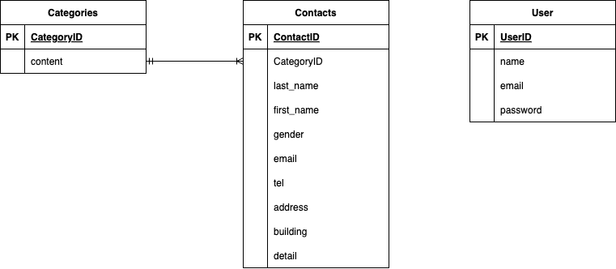

# アプリケーション名
Fashionably Late (問い合わせフォーム)

## 環境構築

### Dockerビルド
1. `git clone git@github.com:hstonewell/ability-test.git`
2. `docker-compose up -d --build`

### Laravel環境構築
1. `docker-compose exec php bash`
2. `composer install`
3. .env.exampleファイルから.envを作成し、環境変数を変更
4. `php artisan key:generate`
5. `php artisan migrate`
6. `php artisan db:seed`

## 使用技術(実行環境)
- Laravel 8.83.27
- mysql 8.0.26
- PHP 7.4.9
- Fortify

## ER図

## URL
- 開発環境：http://localhost/
- phpMyAdmin：http://localhost:8080/
